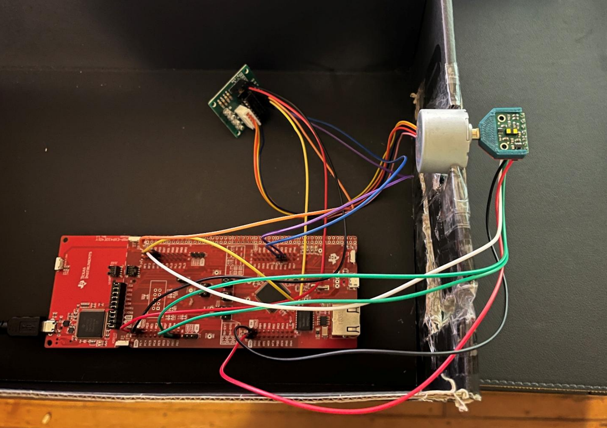
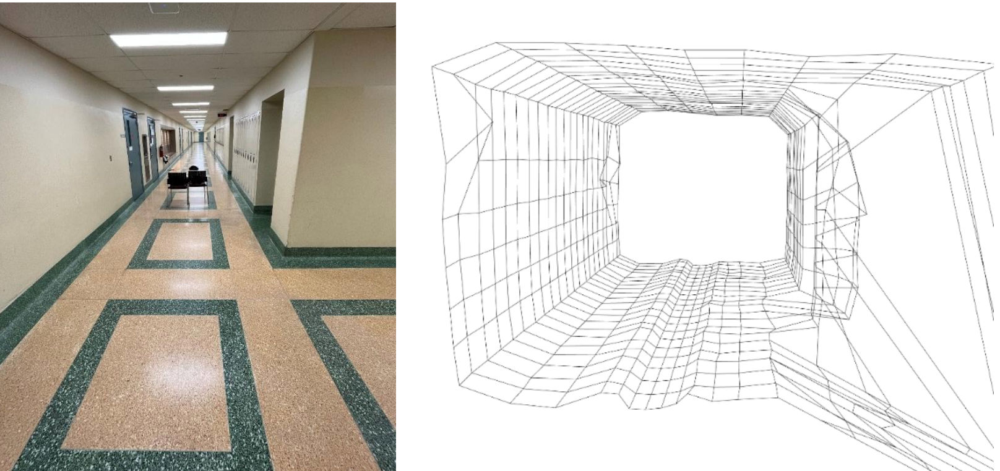

# Embedded 3D Spatial Mapping System

This repository contains the final project for COMPENG 2DX3: an Embedded 3D Spatial Mapping System. The system integrates a Time-of-Flight (ToF) sensor, stepper motor, and MSP432E401Y microcontroller to capture spatial measurements and reconstruct a 3D model of an indoor environment on a PC.

All project materials are included here:

- 📄 Final Report (technical datasheet + application note)

- 💻 Embedded C code for MSP432E401Y

- 🐍 Python scripts for data visualization (NumPy + Open3D)
  

📘 Project Overview:

The goal of this project was to design and implement a low-cost LIDAR-like device capable of mapping hallways or rooms. Using a VL53L1X ToF sensor mounted on a 28BYJ-48 stepper motor, the system performs vertical plane scans and builds a full 3D reconstruction by integrating multiple slices along the X-axis.

Here’s the physical system setup:

And here’s an example of the 3D mapping results:

✨ Key Features:
- Microcontroller: Texas Instruments MSP432E401Y ARM Cortex-M4F
- Sensor: ST VL53L1X Time-of-Flight (up to 4m range, 50Hz)
- Actuator: 28BYJ-48 stepper motor (512 steps/rev) with ULN2003 driver
- Interfaces:
  - I²C for ToF sensor
  - GPIO for motor control & LEDs
  - UART (115200 baud) for data transfer to PC
- User Inputs: On-board pushbutton (interrupt start)
- Status LEDs:
  - D1 – Measurement active
  - D2 – UART transmission
  - D3 – Motor stepping
- Software:
  - Embedded C (Keil uVision 5)
  - Python 3.8+ (NumPy + Open3D)
    

⚙️ System Design:

Block Diagram:
- ToF Sensor (VL53L1X) → Distance Data → MSP432E401Y → UART → PC
- Stepper Motor rotates sensor for 32 angular samples per scan (11.25° increments).
- PC processes polar data → Cartesian (x,y,z) → Open3D point cloud visualization.

Data Acquisition:
- Pushbutton Interrupt → Initiates scan.
- Stepper Motor rotates sensor through 360°.
- ToF Sensor records distance at each step (mm resolution).
- Microcontroller stores angle + distance pairs in RAM.
- UART Transmission sends CSV-style data to PC.
- Python Script converts polar to Cartesian and renders 3D point cloud.

Visualization:
- Uses NumPy for trig conversions.
- Uses Open3D to generate interactive 3D models with point clouds + line meshes.
  

🚀 How to Run:

Hardware Setup:
- Mount VL53L1X ToF sensor on stepper motor (vertical scanning).
- Wire ToF sensor (I²C) and stepper motor driver (GPIO) to MSP432E401Y.
- Connect LaunchPad to PC via USB.

Software Setup:
- On PC: Install Python 3.8+ with numpy, pyserial, and open3d.
- On MCU: Load firmware with Keil uVision 5.

Execution Steps:
- Run Python script, configure COM port.
- Press PJ1 button → system begins scan.
- Repeat scans at fixed manual displacements (e.g., 300mm apart).
- Final 3D map renders in Open3D interactive window.
  

📊 Results:
- Successfully mapped assigned hallway (location D).
- Completed 22 depth scans, each with 32 samples, spaced 300mm apart.
- Produced accurate 3D reconstructions of walls, doors, and structural features.
- Demonstrated robust UART communication and real-time PC visualization.

⚠️ Limitations:
- Manual displacement along X-axis (no automated translation).
- Stepper speed & ToF timing budget limited scan rate.
- Quantization error: ~1mm per measurement.
- UART limit: 115200 baud was the maximum stable communication rate.

📜 Acknowledgements:
- Course: COMPENG 2DX3 – Microprocessor Systems Project
- Instructors: Dr. Shahrukh Athar, Dr. Thomas Doyle, Dr. Yaser Haddara
- Supported by McMaster University, Department of Electrical & Computer Engineering
- Libraries: MacUILib, NumPy, Open3D
